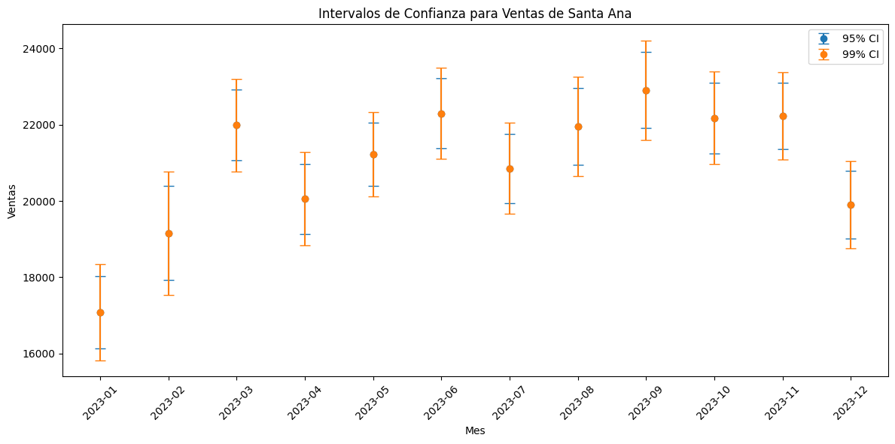
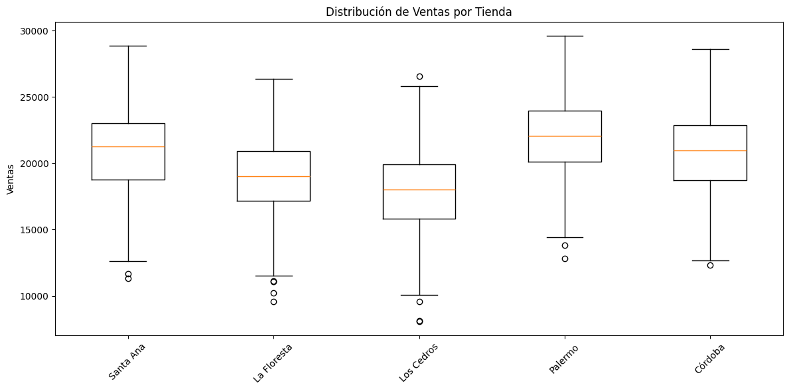
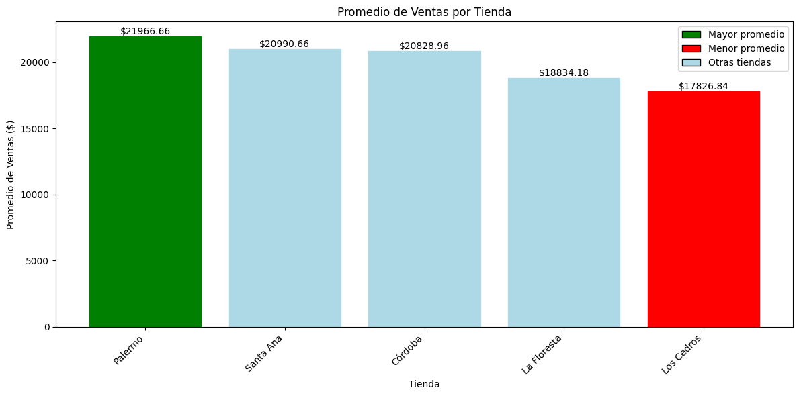
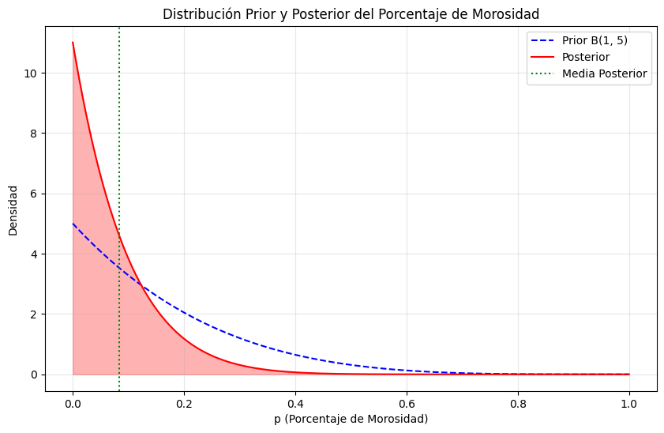

# PEIA 18C02024 - Grupo 8 - Examen Final

- Manuel Pineyro
- Paola Cartala
- Ezequiel Caamaño

## Preguntas de Investigación

1. Intervalos de confianza para el supermercado 'Santa Ana'
2. Comparación de ventas entre supermercados (ANOVA)
3. Comparación entre tiendas con mayor y menor promedio de ventas
4. Análisis bayesiano del porcentaje de morosidad

## 1. Intervalos de Confianza para 'Santa Ana'

**Pregunta:** Determinen intervalos de confianza empíricos para el supermercado 'Santa Ana' en cada mes, para significancias del 95% y el 99%.

### Resultados y Análisis

Resumen de Intervalos de Confianza para Ventas de Santa Ana (2023):

1. Tendencia General:

   - Las ventas muestran una clara estacionalidad a lo largo del año.
   - Los meses de invierno (enero y febrero) presentan las ventas más bajas.
   - Los meses de verano y otoño tienden a tener ventas más altas.

2. Ventas Promedio:

   - Mes con ventas más altas: Septiembre (22.908,47)
   - Mes con ventas más bajas: Enero (17.080,03)

3. Intervalos de Confianza:

   - Los intervalos de confianza del 99% son más amplios que los del 95%, como es de esperar.
   - La amplitud de los intervalos varía entre meses, sugiriendo diferentes niveles de variabilidad en las ventas según la época del año.

4. Observaciones Destacadas:

   - Hay un aumento significativo en las ventas desde enero hasta marzo.
   - Las ventas se mantienen relativamente estables de marzo a noviembre.
   - Diciembre muestra una disminución en las ventas comparado con los meses anteriores.

5. Interpretación:
   - Los intervalos de confianza más estrechos (por ejemplo, en abril) indican meses con menor variabilidad en las ventas.
   - Los intervalos más amplios (como en febrero) sugieren mayor incertidumbre o variabilidad en las ventas de ese mes.

Esta información proporciona una visión clara de los patrones de venta en Santa Ana a lo largo del año 2023, permitiendo una mejor planificación y toma de decisiones basadas en la estacionalidad y la variabilidad de las ventas.

## 2. Comparación de Ventas entre Supermercados (ANOVA)

**Pregunta:** Realicen pruebas ANOVA para determinar si las ventas esperadas de todas las tiendas son iguales o no, con significancia del 95%.

### Resultados y Análisis

Resumen de la Prueba ANOVA para Comparación de Ventas entre Tiendas:

1. Resultados Estadísticos:

   - Estadístico F: 115,42737881295834
   - Valor p: 8,232720009425583e-88

2. Interpretación:

   - Rechazamos la hipótesis nula.
   - Hay evidencia estadística significativa para afirmar que las ventas esperadas de las tiendas no son todas iguales.

3. Análisis Detallado:

   - El estadístico F es muy alto, lo que indica una variación sustancial entre las ventas de las diferentes tiendas.
   - El valor p es extremadamente pequeño, muy por debajo del nivel de significancia convencional de 0.05.
   - Estos resultados proporcionan una evidencia contundente de que existen diferencias significativas en el rendimiento de ventas entre las tiendas.

4. Implicaciones Prácticas:

   - Se recomienda investigar los factores que contribuyen a estas diferencias en el desempeño de ventas.
   - Existe la oportunidad de aprender de las tiendas con mejor rendimiento y aplicar esas lecciones a las de menor rendimiento.
   - Puede ser necesario ajustar la asignación de recursos y la planificación estratégica basándose en estas diferencias de rendimiento.
   - Se sugiere realizar análisis adicionales (como pruebas post-hoc) para identificar qué tiendas específicas difieren entre sí.

5. Conclusión:
   Los resultados indican claramente que no todas las tiendas están teniendo un desempeño igual en términos de ventas. Estas diferencias son estadísticamente significativas y merecen una atención y análisis más detallados para optimizar el rendimiento general de la cadena de supermercados.

## 3. Comparación entre Tiendas con Mayor y Menor Promedio de Ventas

**Pregunta:** Identifiquen la tienda con mayor promedio de ventas y la tienda con menor promedio de ventas y realicen una prueba de hipótesis para determinar si la diferencia entre ellas es distinta de cero o no.

### Resultados y Análisis

Resumen de la Comparación entre Tiendas con Mayor y Menor Promedio de Ventas:

1. Identificación de Tiendas:

   - Mayor promedio de ventas: Palermo ($21.966,66)
   - Menor promedio de ventas: Los Cedros ($17.826,84)

2. Resultados de la Prueba de Hipótesis:

   - Estadístico t: 18,73440363846437
   - Valor p: 3,25554210176414e-64

3. Conclusión Estadística:
   Rechazamos la hipótesis nula. Hay evidencia estadística significativa para afirmar que la diferencia en ventas entre las dos tiendas es distinta de cero.

4. Diferencia en Ventas:
   La diferencia en ventas promedio entre Palermo y Los Cedros es de $4.139,81.

5. Interpretación:

   - El valor p extremadamente bajo (3.26e-64) indica una evidencia muy fuerte contra la hipótesis nula.
   - Esto sugiere que la diferencia observada en las ventas entre Palermo y Los Cedros no se debe al azar, sino que representa una diferencia real y significativa en el rendimiento.
   - El alto valor del estadístico t (18.73) refuerza la conclusión de que existe una diferencia sustancial entre las ventas de las dos tiendas.

6. Implicaciones Prácticas:
   - La diferencia significativa en las ventas diarias promedio ($4.139,81) entre las tiendas de mejor y peor rendimiento representa una brecha considerable en el desempeño.
   - Esta diferencia podría traducirse en disparidades sustanciales de ingresos a lo largo del tiempo, destacando la importancia de comprender y abordar los factores que contribuyen a esta brecha de rendimiento.
   - Puede haber lecciones valiosas que aprender de las operaciones de la tienda Palermo que podrían aplicarse para mejorar las ventas en Los Cedros y potencialmente en otras tiendas de la cadena.

## 4. Análisis Bayesiano del Porcentaje de Morosidad

**Pregunta:** Determinen la distribución a posteriori del parámetro p de porcentaje de morosidad. Determinar su media y su varianza.

### Resultados y Análisis

Resumen del Análisis Bayesiano del Porcentaje de Morosidad:

1. Distribución Posterior:

   - Media: 0,0833 (8,33%)
   - Varianza: 0,005876

2. Interpretación de la Distribución:

   - La distribución posterior (línea roja) está más concentrada y desplazada hacia la izquierda en comparación con la distribución prior (línea azul punteada).
   - Esto indica que los datos observados (0 clientes morosos de 6) han actualizado nuestra creencia inicial hacia una menor probabilidad de morosidad.

3. Estimación del Porcentaje de Morosidad:

   - La mejor estimación puntual del porcentaje de morosidad es 8,33%.
   - Esta estimación es considerablemente menor que la media de la distribución prior B(1, 5), que sería 1/6 $\approx$ 16,67%.

4. Incertidumbre:

   - La varianza relativamente baja (0.005876) sugiere una incertidumbre moderada en la estimación.
   - El gráfico muestra que la mayoría de la masa de probabilidad se concentra en valores bajos de morosidad.

5. Implicaciones para Don Francisco:

   - Basado en la información previa y los datos observados, se espera que la tasa de morosidad sea baja, alrededor del 8,33%.
   - Hay una alta probabilidad de que la verdadera tasa de morosidad sea menor al 20%, como se puede observar en el gráfico.
   - La ausencia de clientes morosos en la muestra actual ha reforzado la expectativa de una baja tasa de morosidad.

6. Consideraciones:
   - Esta estimación se basa en una muestra pequeña (6 clientes) y podría actualizarse con más datos.
   - La distribución prior B(1, 5) influyó en mantener una estimación de morosidad mayor que cero, a pesar de no observar clientes morosos en la muestra actual.

En resumen, el análisis bayesiano sugiere que Don Francisco puede esperar una tasa de morosidad relativamente baja en sus ventas a crédito, con una mejor estimación del 8,33%, aunque existe cierta incertidumbre en esta estimación debido al tamaño limitado de la muestra.

## Conclusión

Basándonos en el análisis realizado, podemos concluir lo siguiente para Don Francisco:

1. Ventas de Santa Ana:

   - Las ventas de Santa Ana muestran una clara estacionalidad a lo largo del año.
   - Los meses de invierno (enero y febrero) presentan las ventas más bajas, mientras que los meses de verano y otoño tienden a tener ventas más altas.
   - El mes con ventas más altas es septiembre (22.908,47) y el más bajo es enero (17.080,03).
   - Esta información permite una mejor planificación y toma de decisiones basadas en la estacionalidad de las ventas.

2. Comparación entre supermercados:

   - El análisis ANOVA reveló que existen diferencias significativas en las ventas entre las distintas tiendas.
   - La tienda Palermo muestra el mejor desempeño con un promedio de ventas de $21.966,66.
   - La tienda Los Cedros tiene el menor promedio de ventas con $17.826,84.
   - La diferencia en ventas promedio entre estas dos tiendas es de $4.139,81, lo cual es estadísticamente significativo.
   - Estos resultados indican que algunas tiendas, especialmente Los Cedros, pueden necesitar más atención para mejorar su rendimiento.

3. Análisis de morosidad:
   - Basado en el análisis bayesiano, se estima que la tasa de morosidad es relativamente baja, alrededor del 8,33%.
   - Hay una alta probabilidad de que la verdadera tasa de morosidad sea menor al 20%.
   - Estos resultados sugieren que el comportamiento de pago de los clientes a crédito es generalmente bueno, aunque se recomienda seguir monitoreando de cerca.

Limitaciones del Estudio:

- La estacionalidad observada en los intervalos de confianza podría requerir un análisis más detallado para comprender completamente sus implicaciones en la planificación a largo plazo.
- El análisis ANOVA indica diferencias significativas, pero se necesitan pruebas post-hoc para identificar exactamente qué tiendas difieren entre sí y en qué medida.
- La muestra pequeña para el análisis de morosidad (6 clientes) aumenta la incertidumbre de la estimación. Se recomienda recopilar más datos para obtener una estimación más robusta.
- Factores externos como la ubicación, el tamaño de la tienda, la demografía local, etc., no se consideraron en las comparaciones entre tiendas, lo que podría influir en las diferencias de rendimiento observadas.
- El estudio se basa en datos de un período específico y podría no capturar tendencias a largo plazo o cambios recientes en el mercado.

Recomendaciones para Don Francisco:

1. Implementar estrategias de ventas estacionales en Santa Ana, aprovechando los meses de mayor actividad y preparándose para los de menor venta.
2. Investigar las prácticas exitosas de la tienda Palermo y considerar aplicarlas en otras tiendas, especialmente en Los Cedros.
3. Desarrollar un plan de mejora específico para Los Cedros para cerrar la brecha de rendimiento con las demás tiendas.
4. Mantener la política actual de ventas a crédito, dado el bajo riesgo de morosidad, pero continuar monitoreando de cerca.
5. Implementar un sistema de benchmarking interno para comparar regularmente el rendimiento entre tiendas y fomentar la mejora continua.

En general, estos análisis proporcionan a Don Francisco una visión clara de las dinámicas de venta en sus supermercados y le ofrecen una base sólida para la toma de decisiones estratégicas y operativas.
